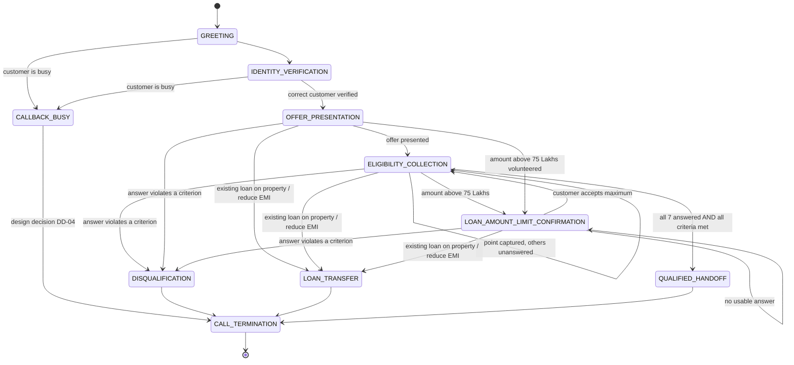
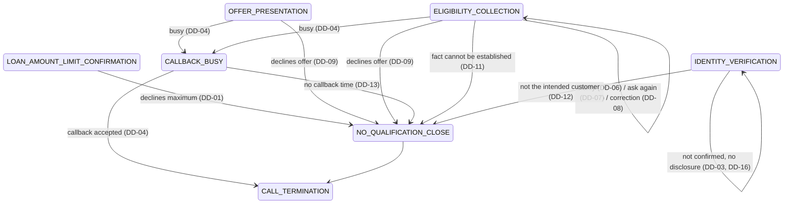

# Conversation State Model

State machine for the Home Credit Loan Against Property (LAP) qualification call.

- This is a specification model. It is not code, not a prompt and not tied to any voice platform.
- State names, field names and `call_outcome` values are modelling labels chosen for this document. They are not terms from the assignment and add no requirements.
- Requirement IDs (`REQ-*`) and ambiguity IDs (`AMB-*`) are defined in [assignment-requirements.md](assignment-requirements.md); rule IDs (`BR-*`) in [business-rules.md](business-rules.md).
- Transitions the assignment does not define are marked **unspecified** with an `AMB` ID rather than filled in.
- Behaviour the project has chosen for those gaps is a **design decision** (`DD-*`, see [design-decisions.md](design-decisions.md)). Design-decision states and transitions are kept in [section 9](#9-design-decision-states-and-transitions), apart from the source-defined model in sections 1–8.

## 1. States

| State | Purpose | Kind |
|---|---|---|
| `GREETING` | Agent opens the call and introduces itself. | Flow |
| `IDENTITY_VERIFICATION` | Agent verifies it is speaking with the correct customer. | Flow |
| `OFFER_PRESENTATION` | Agent explains the reason for the call and the LAP offer of up to 75,00,000 (75 Lakhs). | Flow |
| `ELIGIBILITY_COLLECTION` | Agent captures the seven eligibility data points. | Flow |
| `LOAN_AMOUNT_LIMIT_CONFIRMATION` | Sub-state of eligibility collection: customer asked for more than 75 Lakhs; agent has explained the limit and asked whether to proceed with the maximum. | Flow (sub-state) |
| `CALLBACK_BUSY` | Customer is busy; agent acknowledges and asks for a preferred callback time. | Exit path |
| `DISQUALIFICATION` | Agent politely informs the customer they do not meet the criteria for this specific offer at this time. | Exit path |
| `LOAN_TRANSFER` | Agent informs the customer that a specialist for loan transfer will contact them shortly. | Exit path |
| `QUALIFIED_HANDOFF` | Agent informs the customer that a senior loan expert will call back shortly to provide exact interest rates. | Exit path |
| `CALL_TERMINATION` | The call ends. | **Terminal** |

## 2. State diagram



The diagram shows only transitions the assignment defines, with one exception: the source does not say the call ends after the busy/callback exchange, so that edge is labelled as a design decision (DD-04). Unspecified transitions are listed in [section 8](#8-unspecified-transitions).

## 3. Collected fields

### 3.1 Eligibility fields

| # | Field | Values captured | Mandatory | Disqualifying value | Rule |
|---|---|---|---|---|---|
| 1 | `property_type` | Residential / Commercial / Industrial / Agricultural | Yes | Agricultural | BR-EL-01 |
| 2 | `ownership_status` | Sole / Joint | Yes | none | BR-EL-02 |
| 3 | `documents_available` | Original documents available / unavailable | Yes | unavailable | BR-EL-03 |
| 4 | `loan_amount` | Amount the customer wants to borrow | Yes | none immediate; above 75 Lakhs goes to `LOAN_AMOUNT_LIMIT_CONFIRMATION` | BR-EL-04, BR-EL-04a |
| 5a | `occupation` | Salaried / Self-Employed | Yes | none | BR-EL-05 |
| 5b | `income_mode` | Bank / Cash | Yes | Cash | BR-EL-05 |
| 6 | `market_value` | Estimated current market value of the property | Yes | none (no threshold) | BR-EL-06 |
| 7 | `tenure_years` | Repayment period in years | Yes | below 3 or above 15 | BR-EL-07 |

Eligibility point 5 is a single checklist item with two components; it is answered only when both `occupation` and `income_mode` are captured (BR-EL-05a).

Each field is in one of two statuses:

| Status | Meaning |
|---|---|
| `UNANSWERED` | No usable value has been captured yet. |
| `ANSWERED` | A value has been captured, whether in order or out of order. |

A question that was asked but not answered (because of an interruption, a diversion or a filler-only reply) leaves the field `UNANSWERED`.

### 3.2 Control fields

| Field | Meaning | Mandatory |
|---|---|---|
| `identity_verified` | The correct customer has been verified. | Yes, before `OFFER_PRESENTATION` |
| `offer_presented` | The offer has been explained. | Yes, before the first eligibility question |
| `loan_amount_requested` | The amount originally requested, when it was above 75 Lakhs. | Only on the over-limit path |
| `callback_time` | Preferred callback time given by a busy customer. | Only on the busy path |
| `transfer_reason` | Existing loan on the property, or wants to reduce current EMI. | Only on the transfer path |
| `disqualification_reason` | The criterion that was not met. | Only on the disqualification path |
| `call_outcome` | `QUALIFIED`, `DISQUALIFIED`, `TRANSFER` or `CALLBACK`. Design decisions add `DECLINED_MAXIMUM`, `NOT_INTERESTED`, `INCOMPLETE`, `WRONG_PERSON` and `NO_CALLBACK_TIME` (section 9). | Yes, at `CALL_TERMINATION` |

### 3.3 Inputs (prompt variables)

`company_name`, `customer_name`, `agent_name`, `agent_gender`, `current_date`, `current_day`, `current_time`, `additional_context_from_rag`, `language_to_speak`, `conversation_history`, `customer_utterance` (REQ-PV-01–11). `conversation_history` carries the state above from turn to turn.

## 4. Transitions and conditions

| ID | From | To | Condition | Agent action on transition | Rule |
|---|---|---|---|---|---|
| T-01 | start | `GREETING` | Call connects. | Greets the customer and introduces itself. | REQ-UC-02 |
| T-02 | `GREETING` | `IDENTITY_VERIFICATION` | Greeting delivered. | Checks it is speaking with the correct customer. | REQ-CS-01 |
| T-03 | `IDENTITY_VERIFICATION` | `OFFER_PRESENTATION` | Correct customer verified (`identity_verified` set). | Explains the reason for the call and the offer of up to 75 Lakhs. | BR-CC-07, BR-CC-08 |
| T-04 | `GREETING`, `IDENTITY_VERIFICATION` | `CALLBACK_BUSY` | Customer says they are busy. | Acknowledges and asks for a preferred callback time. | BR-CB-01, BR-CB-02 |
| T-05 | `OFFER_PRESENTATION` | `ELIGIBILITY_COLLECTION` | Offer presented (`offer_presented` set). Whether the customer must first agree to continue is unspecified (AMB-05); design decision DD-15 adds no consent step. | Asks the first unanswered eligibility point. | REQ-EL-00 |
| T-06 | `ELIGIBILITY_COLLECTION` | `ELIGIBILITY_COLLECTION` | A value is captured that meets its criterion, and at least one field is still `UNANSWERED`. | Asks the next unanswered point (lowest-numbered first). | BR-CC-06 |
| T-07 | `ELIGIBILITY_COLLECTION`, `LOAN_AMOUNT_LIMIT_CONFIRMATION` | same state | The reply contains no usable answer (interruption, question, filler). | Addresses what the customer said. The pending point stays `UNANSWERED` and must be asked again before any handoff; under sequential capture it is asked again before any later point. | BR-CC-03, BR-HO-03 |
| T-08 | `OFFER_PRESENTATION`, `ELIGIBILITY_COLLECTION` | `LOAN_AMOUNT_LIMIT_CONFIRMATION` | Customer requests more than 75 Lakhs, whether asked or volunteered. | Explains the limit and asks whether to proceed with the maximum allowed amount. | BR-EL-04a |
| T-09 | `LOAN_AMOUNT_LIMIT_CONFIRMATION` | `ELIGIBILITY_COLLECTION` | Customer agrees to the maximum allowed amount. | Records `loan_amount` as 75 Lakhs; continues with the next unanswered point. | BR-EL-04a |
| T-10 | `OFFER_PRESENTATION`, `ELIGIBILITY_COLLECTION`, `LOAN_AMOUNT_LIMIT_CONFIRMATION` | `DISQUALIFICATION` | Any captured value violates its criterion: Agricultural property, original documents unavailable, Cash income, or tenure outside 3–15 years. Applies to out-of-order values too. | Politely informs the customer they do not meet the criteria for this specific offer at this time. Asks nothing further. | BR-DQ-01–08 |
| T-11 | `OFFER_PRESENTATION`, `ELIGIBILITY_COLLECTION`, `LOAN_AMOUNT_LIMIT_CONFIRMATION` | `LOAN_TRANSFER` | Customer mentions an existing loan on the property, or wanting to reduce their current EMI. | Informs the customer that a specialist for loan transfer will contact them shortly. Asks nothing further. | BR-TR-02–05 |
| T-12 | `ELIGIBILITY_COLLECTION` | `QUALIFIED_HANDOFF` | **All** seven points are `ANSWERED` **and** every value meets its criterion. | Informs the customer that a senior loan expert will call back shortly to provide exact interest rates. | BR-HO-01, BR-HO-02 |
| T-13 | `CALLBACK_BUSY` | `CALL_TERMINATION` | Callback request accepted. **Design decision DD-04, not stated by the source:** the assignment says only to acknowledge and ask for a preferred callback time (AMB-03). | Ends the interaction without continuing qualification. `call_outcome = CALLBACK`. | BR-DD-04 |
| T-14 | `DISQUALIFICATION` | `CALL_TERMINATION` | Disqualification message delivered. | Ends the call. `call_outcome = DISQUALIFIED`. | BR-DQ-07 |
| T-15 | `LOAN_TRANSFER` | `CALL_TERMINATION` | Transfer message delivered. | Ends the call. `call_outcome = TRANSFER`. | BR-TR-04 |
| T-16 | `QUALIFIED_HANDOFF` | `CALL_TERMINATION` | Handoff message delivered. | Ends the call. `call_outcome = QUALIFIED`. | BR-HO-02 |

### Guard on T-12 (handoff gate)

`QUALIFIED_HANDOFF` is reachable **only** from `ELIGIBILITY_COLLECTION` and **only** when:

```
property_type, ownership_status, documents_available, loan_amount,
occupation, income_mode, market_value, tenure_years   are all ANSWERED
AND property_type       is Residential, Commercial or Industrial
AND ownership_status    is Sole or Joint
AND documents_available is "available"
AND loan_amount         is 75 Lakhs or less
AND occupation          is Salaried or Self-Employed
AND income_mode         is Bank
AND tenure_years        is between 3 and 15
```

The guard lists only the values the assignment names as eligible. A value the assignment does not classify (AMB-06, AMB-09, AMB-22) therefore cannot pass the guard, and is not a disqualification either: its handling is not defined by the source. Design decision DD-06 (T-20) covers it. `market_value` has no value condition.

If the guard fails because a field is `UNANSWERED`, the only allowed move is T-06/T-07: ask for that field. This holds even when the customer asks to be passed to the expert early, and even when the question was already asked once but skipped because of a diversion (BR-HO-03, BR-HO-05).

## 5. Out-of-order information

The default order is point 1 → point 7. The customer may give information before its turn.

1. **Capture.** Every customer utterance is examined for values of *any* of the seven points, not only the point just asked.
2. **Remember.** A captured field becomes `ANSWERED` and stays so for the rest of the call.
3. **Do not re-ask.** An `ANSWERED` field is never asked again.
4. **Continue.** The next question is the lowest-numbered field that is still `UNANSWERED`.
5. **Check immediately.** An out-of-order value is checked against its criterion when it is captured. A disqualifying value triggers T-10 at once; a loan amount above 75 Lakhs triggers T-08 at once.
   Values volunteered during `OFFER_PRESENTATION` are captured the same way; this does not remove the need to present the offer (`offer_presented`) before the checklist continues.
6. **Partial point 5.** If only `occupation` or only `income_mode` is given, the given part is kept and only the missing part is asked for.
7. **Multiple values in one utterance.** All are captured in the same turn; steps 2–5 apply to each.

Not specified: information volunteered before identity verification (AMB-13), and a customer who later changes a captured value (AMB-14). Design decision DD-08 (T-22) covers the latter and DD-16 (T-28) the former.

## 6. Diversions

A *diversion* is any customer turn that does not answer the pending question: an interruption, a question to the agent, a filler, or an unrelated remark.

- The pending field stays `UNANSWERED`.
- The agent responds to the diversion and returns to the pending field (T-07). The source requires this before the handoff ("go back and ask them"); returning before any later point follows from sequential capture.
- A diversion never advances the conversation toward `QUALIFIED_HANDOFF` and never marks a field as answered.
- A diversion that contains a transfer trigger or a disqualifying value follows T-11 or T-10.

## 7. Terminal states

`CALL_TERMINATION` is the only terminal state. It is reached through exactly one exit path, which fixes `call_outcome`:

| Exit path | `call_outcome` | Last thing the customer is told |
|---|---|---|
| `QUALIFIED_HANDOFF` | `QUALIFIED` | A senior loan expert will call back shortly to provide exact interest rates. |
| `DISQUALIFICATION` | `DISQUALIFIED` | They do not meet the criteria for this specific offer at this time. |
| `LOAN_TRANSFER` | `TRANSFER` | A specialist for loan transfer will contact them shortly. |
| `CALLBACK_BUSY` | `CALLBACK` | Unspecified beyond asking for the preferred callback time (AMB-03). |

Once an exit path is entered, the conversation does not return to `ELIGIBILITY_COLLECTION` (the source says "end the call"). A customer retracting the answer that caused the exit is not addressed by the source (AMB-14); design decision DD-08 keeps the flow closed.

## 8. Unspecified transitions

The assignment does not define these. They are deliberately absent from the diagram and the transition table in sections 2 and 4. The last column shows whether a design decision now covers the gap.

| Situation | Ambiguity | Design decision |
|---|---|---|
| Person is not the customer, or the customer is unavailable (`IDENTITY_VERIFICATION` → ?) | AMB-01, AMB-02 | DD-03 (T-23), DD-12 (T-26) |
| Customer says they are busy after the offer or during eligibility collection | AMB-03 | DD-04 (T-24) |
| What follows once a callback time is given, including whether the call ends | AMB-03 | DD-04 (T-13) |
| Customer gives no callback time | AMB-03 | DD-13 (T-27) |
| Customer is not interested in the offer | AMB-04 | DD-09 (T-18) |
| Whether agreement is needed between `OFFER_PRESENTATION` and `ELIGIBILITY_COLLECTION` | AMB-05 | DD-15: no consent step; T-05 unchanged |
| Customer declines the maximum amount (`LOAN_AMOUNT_LIMIT_CONFIRMATION` → ?) | AMB-08 | DD-01 (T-17) |
| Answer does not map to an accepted category | AMB-06, AMB-09, AMB-22 | DD-06 (T-20) |
| Transfer trigger and disqualifying value in the same utterance | AMB-12 | DD-02 (T-11 has priority over T-10) |
| Transfer trigger or disqualifying value given during `GREETING` / `IDENTITY_VERIFICATION` | AMB-12, AMB-13 | DD-16 (T-28) |
| Customer corrects an earlier answer | AMB-14 | DD-08 (T-22) |
| Customer does not know, or will not give, a required value | AMB-10, AMB-15 | DD-07 (T-21), DD-11 (T-25) |
| Silence, voicemail, dropped call | AMB-24 | Open |

## 9. Design-decision states and transitions

> **Everything in this section is a project design decision, not a requirement from the assignment PDF.** Reasoning is in [design-decisions.md](design-decisions.md). Nothing here adds an eligibility criterion or a new way to reach `QUALIFIED_HANDOFF`.

### 9.1 Added state

| State | Purpose | Kind | Decision |
|---|---|---|---|
| `NO_QUALIFICATION_CLOSE` | The call closes politely without qualification and without any eligibility criterion having failed: the customer declined the maximum amount or the offer, a required fact could not be established, the person is not the intended customer, or a busy customer gave no callback time. Because no criterion has failed, this is never `DISQUALIFICATION` and the customer is not told they are ineligible. | Exit path | DD-01, DD-09, DD-11, DD-12, DD-13 |

### 9.2 Added transitions

| ID | From | To | Condition | Agent action on transition | Decision |
|---|---|---|---|---|---|
| T-17 | `LOAN_AMOUNT_LIMIT_CONFIRMATION` | `NO_QUALIFICATION_CLOSE` | Customer does not want to proceed with the maximum allowed amount. | Respects the decision. Gives no handoff message and does not agree to more than 75 Lakhs. | DD-01 |
| T-18 | `OFFER_PRESENTATION`, `ELIGIBILITY_COLLECTION`, `LOAN_AMOUNT_LIMIT_CONFIRMATION` | `NO_QUALIFICATION_CLOSE` | Customer clearly declines the offer. | Acknowledges the decision. Asks no further eligibility question and gives no handoff message. | DD-09 |
| T-19 | `NO_QUALIFICATION_CLOSE` | `CALL_TERMINATION` | Closing delivered. | Ends the call politely. `call_outcome` = `DECLINED_MAXIMUM` (after T-17), `NOT_INTERESTED` (after T-18), `INCOMPLETE` (after T-25), `WRONG_PERSON` (after T-26) or `NO_CALLBACK_TIME` (after T-27). | DD-01, DD-09, DD-11, DD-12, DD-13 |
| T-20 | `ELIGIBILITY_COLLECTION` | `ELIGIBILITY_COLLECTION` | The answer does not clearly map to one of the assignment's accepted categories. | Asks a clarification question. The field stays `UNANSWERED`. Infers nothing, creates no category, does not disqualify. | DD-06 |
| T-21 | `ELIGIBILITY_COLLECTION`, `LOAN_AMOUNT_LIMIT_CONFIRMATION` | same state | Customer does not know, or declines to give, a required value. | Explains that the information is needed for preliminary qualification and asks again naturally. The field stays `UNANSWERED`, so the guard on T-12 keeps blocking the handoff. Does not disqualify. | DD-07 |
| T-22 | `OFFER_PRESENTATION`, `ELIGIBILITY_COLLECTION`, `LOAN_AMOUNT_LIMIT_CONFIRMATION` | same state, unless the new value triggers T-08 or T-10 | Customer explicitly corrects an earlier answer while the conversation is active. | Replaces the earlier value with the corrected one and checks it against its criterion. Does not re-ask other answered points. | DD-08 |
| T-23 | `IDENTITY_VERIFICATION` | `IDENTITY_VERIFICATION` | The intended customer has not been confirmed. | Does not disclose the LAP offer or eligibility details. Does not request identity data beyond what the assignment provides for. Asks to speak with the intended customer where appropriate. | DD-03, DD-12 |
| T-24 | `OFFER_PRESENTATION`, `ELIGIBILITY_COLLECTION`, `LOAN_AMOUNT_LIMIT_CONFIRMATION` | `CALLBACK_BUSY` | Customer says they are busy after the greeting stage. | Acknowledges and asks for a preferred callback time. Asks no further eligibility question. | DD-04 |
| T-25 | `ELIGIBILITY_COLLECTION`, `LOAN_AMOUNT_LIMIT_CONFIRMATION` | `NO_QUALIFICATION_CLOSE` | A required fact still cannot be established after reasonable clarification (following T-20 or T-21). | Closes politely. Does not qualify, does not hand off, and does not tell the customer they are ineligible. | DD-11 |
| T-26 | `IDENTITY_VERIFICATION` | `NO_QUALIFICATION_CLOSE` | The person is not the intended customer and the intended customer cannot be brought to the call. | Closes the interaction without disclosing the LAP offer or eligibility information. | DD-12 |
| T-27 | `CALLBACK_BUSY` | `NO_QUALIFICATION_CLOSE` | The busy customer cannot provide a preferred callback time. | Closes politely without qualification. | DD-13 |
| T-28 | `GREETING`, `IDENTITY_VERIFICATION` | same state | Before verification, the customer volunteers offer-related information (including a disqualifying value or a transfer trigger). | Discloses no offer or eligibility details and gives no disqualification or transfer message. Continues verification. May preserve the information if useful and technically available. | DD-16 |

### 9.3 Effects on source-defined transitions

| Transition | Effect | Decision |
|---|---|---|
| T-13 | `CALLBACK_BUSY` → `CALL_TERMINATION` exists only by design decision. The source stops at "ask for a preferred callback time". | DD-04 |
| T-10 and T-11 | When one utterance satisfies both, T-11 (`LOAN_TRANSFER`) is taken and T-10 (`DISQUALIFICATION`) is not. | DD-02 |
| T-14, T-15, T-16, T-19 | No transition leads out of an exit path back into the flow, including after a customer correction. | DD-08 |
| T-01 | An interaction starts with every field `UNANSWERED` unless its value is actually available through `conversation_history` or supplied customer/context data. Nothing is assumed from a previous interaction. | DD-14 |
| T-03 | Information preserved under T-28 is treated as an out-of-order detail once the customer is verified, and is checked then; T-10 and T-11 stay unavailable from `GREETING` and `IDENTITY_VERIFICATION`. | DD-16 |
| T-05 | No consent condition is added between the offer and the checklist. A clear refusal takes T-18. | DD-15 |
| All | Transition conditions are evaluated against the assignment's criteria. `additional_context_from_rag` cannot change a condition or add one. | DD-17 |
| T-12 | Unchanged. No design decision adds a way to reach `QUALIFIED_HANDOFF` or relaxes its guard. | — |

### 9.4 Design-decision diagram



### 9.5 Exit paths added by design decision

| Exit path | `call_outcome` | Last thing the customer is told | Decision |
|---|---|---|---|
| `NO_QUALIFICATION_CLOSE` after T-17 | `DECLINED_MAXIMUM` | An acknowledgement of their decision; wording not yet decided. | DD-01 |
| `NO_QUALIFICATION_CLOSE` after T-18 | `NOT_INTERESTED` | An acknowledgement of their decision; wording not yet decided. | DD-09 |
| `NO_QUALIFICATION_CLOSE` after T-25 | `INCOMPLETE` | A polite close. Not that they are ineligible. | DD-11 |
| `NO_QUALIFICATION_CLOSE` after T-26 | `WRONG_PERSON` | A polite close with no offer or eligibility information. | DD-12 |
| `NO_QUALIFICATION_CLOSE` after T-27 | `NO_CALLBACK_TIME` | A polite close. | DD-13 |
